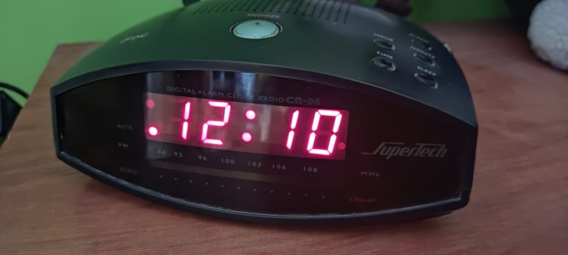
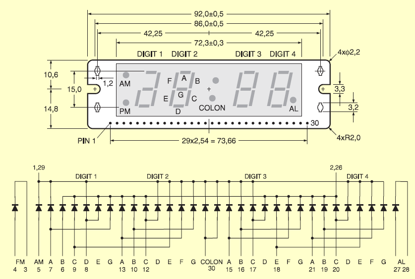
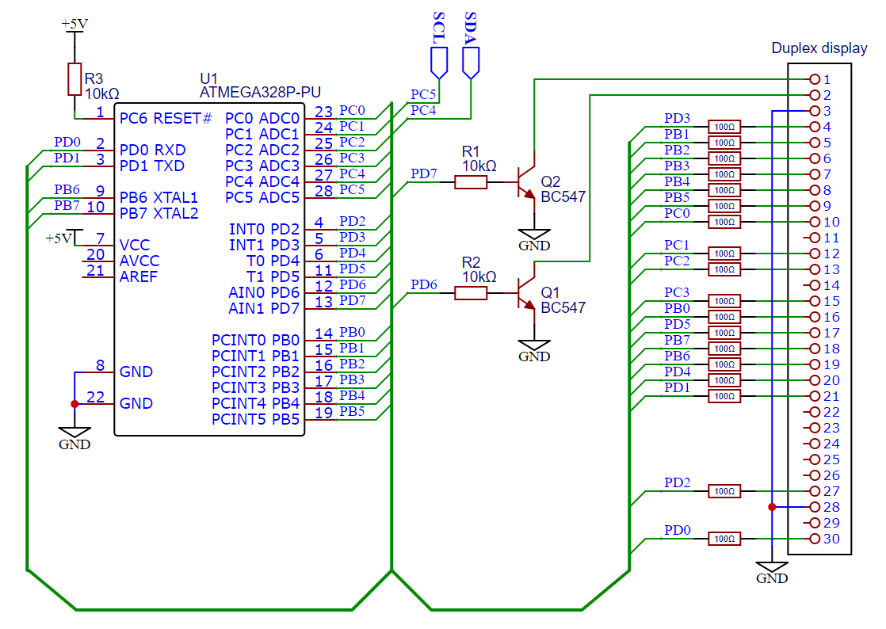

# 7-segment_duplex_display_with_esphome_integration

This project was to upgrade my old bedside clock which turned out to have a more complicated display than I expected. But I wasn't the first to tackle this screen. 
Almost all code to control display come from [Libesz's projects](https://libesz.digitaltrip.hu/digital-clock/) who made great work to handle this. I only make few changes
and write [ESPhome](https://esphome.io/) integration

<p align="center">
  
</p>

## Wiring

<p align="center">
  
  
  Scheme of screen pinout from [Libesz's site](https://libesz.digitaltrip.hu/digital-clock/)
</p>

<p align="center">
  
  
  My modified scheme
</p>

## Software

### ESPhome display configuration
```yaml
i2c: #exa,ple i2c configuration
  sda: D2
  scl: D1

display:
  - platform: duplex_display
    id: duplexDisplay
    address: 0x09
    animation: false #optional - default: false
    colon_blink: false #optional - default: false
    lambda: |-
        it.strftime("%H:%M",id(ds1307_time).now());
```
Colon blink can be done also from [ESPhome way](https://esphome.io/components/display/tm1637.html#creating-a-digital-clock)

### There is option to control AM, PM and alarm LEDs for any purpose
```yaml
switch:
  - platform: template
    name: "PMLed"
    turn_on_action:
      - lambda: id(duplexDisplay).PMLed(true);
    turn_off_action:
      - lambda: id(duplexDisplay).PMLed(false);
      
  - platform: template
    name: "AMLed"
    turn_on_action:
      - lambda: id(duplexDisplay).AMLed(true);
    turn_off_action:
      - lambda: id(duplexDisplay).AMLed(false);
      
  - platform: template
    name: "AlarmLed"
    turn_on_action:
      - lambda: id(duplexDisplay).AlarmLed(true);
    turn_off_action:
      - lambda: id(duplexDisplay).AlarmLed(false);
```
